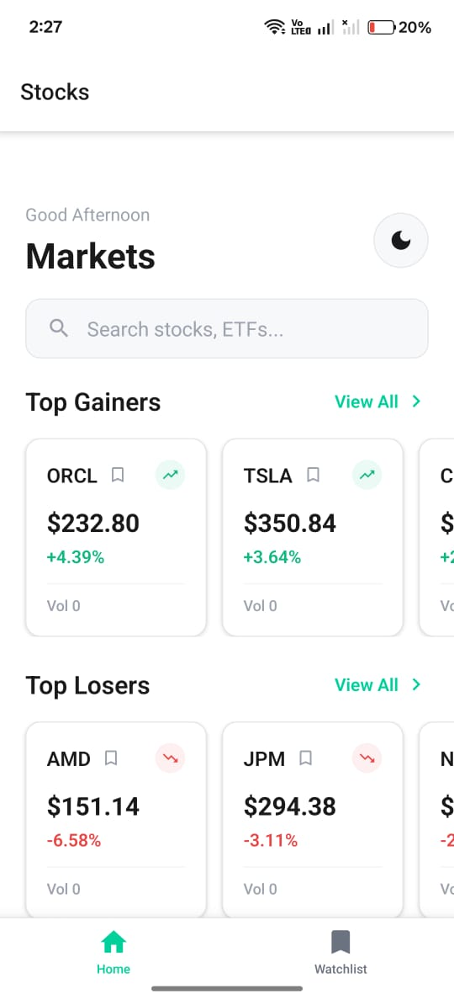
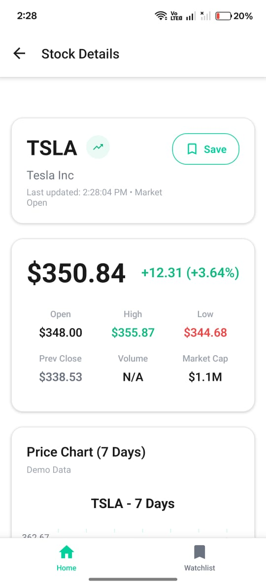
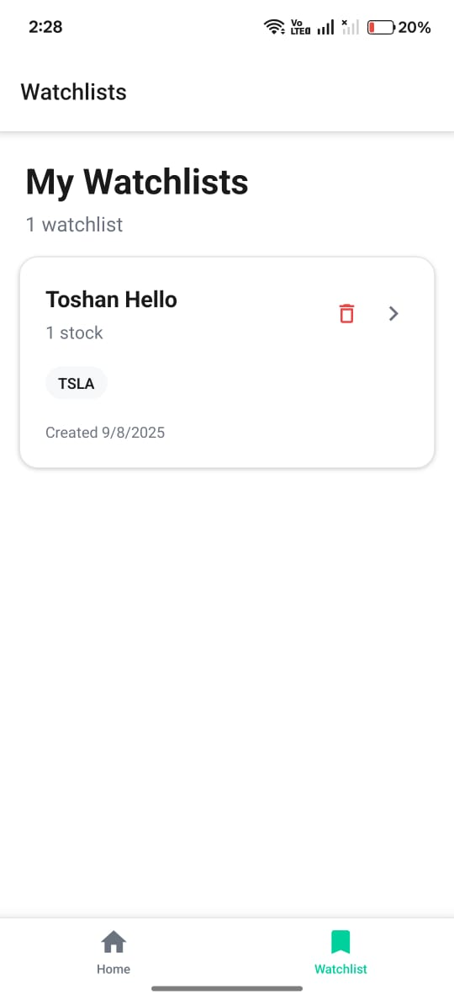
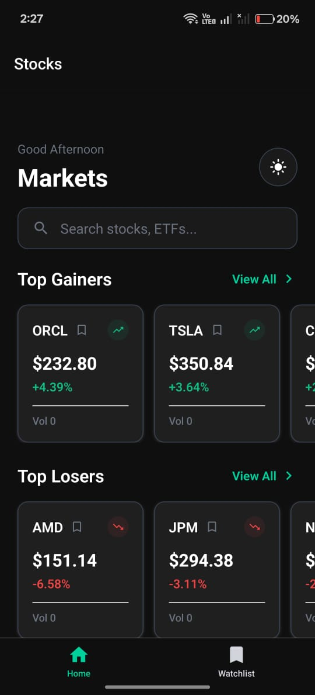

# 📈 Stock Broking - React Native Trading App

> **Assignment Project**: A comprehensive stock market application built with React Native and Expo .

## 🎯 Project Overview

**Stock Broking** is a modern mobile Stock Broking application that provides top gainers and losers insights. Built with React Native and Expo for cross-platform compatibility and rapid development.

## ✨ Core Features

- **🏆 Top Gainers/Losers** - Discover trending market movers 
- **🏆 Watchlist** - Add your favourite stocks for easy access
- **📈 Interactive Charts** - Candlestick charts with multiple timeframes
- **🔍 Smart Search** - Intelligent stock symbol search functionality
- **🌙 Dark/Light Themes** - Seamless theme switching
- **⚡ OTA Updates** - Instant app updates without store resubmission
- **📱 Cross-Platform** - Single codebase for iOS and Android

## 🛠 Technology Stack

| Category | Technology |
|----------|------------|
| **Framework** | React Native with Expo (Managed Workflow) |
| **Navigation** | React Navigation v6 (Native Stack) |
| **State Management** | React Context API + Custom Hooks |
| **API Integration** | Finnhub Stock API with Smart Caching |
| **UI Components** | Custom Components + Expo Vector Icons |
| **Animations** | React Native Reanimated + InteractionManager |
| **Storage** | AsyncStorage with Expiration Logic |
| **Theme System** | Custom Theme Provider (Dark/Light) |

## 📱 Screenshots

### Home Screen

*Real-time market overview with top gainers and losers*

### Stock Details

*Comprehensive stock information with interactive charts*

### Watchlist Management

*Custom watchlists with real-time price updates*

### Dark Theme

*Professional dark mode interface*

## 🚀 Key Technical Highlights

### Smart API Management
- **Rate Limiting Protection**: Prevents API throttling with intelligent delays
- **Comprehensive Caching**: 300+ seconds cache with fallback mechanisms
- **Batch Processing**: Efficient parallel API calls for market data
- **Error Recovery**: Graceful fallbacks when API limits are reached

### Performance Optimizations
- **Lazy Loading**: Components load on-demand for faster startup
- **Memory Management**: Efficient cleanup and garbage collection
- **Smooth Animations**: 60fps transitions using InteractionManager
- **Optimized Rendering**: FlatList optimization for large datasets

### User Experience
- **Professional UI**: Trading-app inspired design patterns
- **Responsive Design**: Optimized for all screen sizes
- **Accessibility**: Screen reader support and proper touch targets
- **Offline Support**: Cached data available without internet

## 🎨 Design System

- **Consistent Theming**: Unified color palette and typography
- **Material Design**: Following platform design guidelines
- **Smooth Transitions**: Professional slide animations
- **Interactive Elements**: Touch feedback and hover states
- **Visual Hierarchy**: Clear information architecture

## 📈 Performance Metrics

- **Startup Time**: < 3 seconds on average devices
- **API Response**: < 2 seconds with caching optimization
- **Memory Usage**: Optimized for low-end devices
- **Bundle Size**: Minimized with code splitting

## 🔍 Assignment Highlights

This project demonstrates proficiency in:
- **Modern React Native Development** with latest best practices
- **State Management** using Context API and custom hooks
- **API Integration** with error handling and optimization
- **Cross-Platform Development** with shared codebase
- **Performance Optimization** for production-grade applications
- **Professional UI/UX Design** following industry standards

## 📞 Contact Information

**Developer**: [Toshan Kanwar]  
**Email**: [contact@toshankanwar.website]  
**LinkedIn**: [https://www.linkedin.com/in/toshan-kanwar-4683a1349/]  
**Portfolio**: [https://toshankanwar.website]

---

**Built for Groww Assignment | React Native & Expo**

> *This project showcases modern mobile app development practices with focus on performance, user experience, and scalable architecture.*

